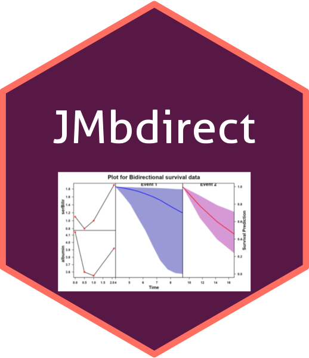

# JMbdirect: Joint Model for Longitudinal and Multiple Time-to-Event Data


<!-- badges: start -->

[](https://CRAN.R-project.org/package=JMbdirect)
[](https://cran.r-project.org/package=JMbdirect)
[](https://cran.r-project.org/web/licenses/GPL-3)

<!-- badges: end -->

> **JMbdirect** provides tools for jointly modeling longitudinal outcomes and multiple time-to-event (survival) outcomes using a variety of statistical engines like **JMbayes2**, **FastJM**, **joineRML**, and **rstanarm**.

---

## ✨ Features

- 🔄 Fit **joint models** with **multiple survival outcomes**
- 🧠 Compatible with popular modeling engines:
  - `JMbayes2`
  - `FastJM`
  - `joineRML`
  - `rstanarm`
- 🔎 Includes functions for:
  - Model fitting (`jmbB()`, `jmcsB()`, `jmrmlB()`, `jmstB()`)
  - Survival prediction
  - Posterior plots
  - Bootstrapped confidence intervals
- 📦 Ready for **big data applications** using the `BIGdata = TRUE` flag

---

## 📦 Installation

### From GitHub (development version)

```r
# If not already installed
install.packages("remotes")
remotes::install_github("kumarbhrigu/JMbdirect")
```
